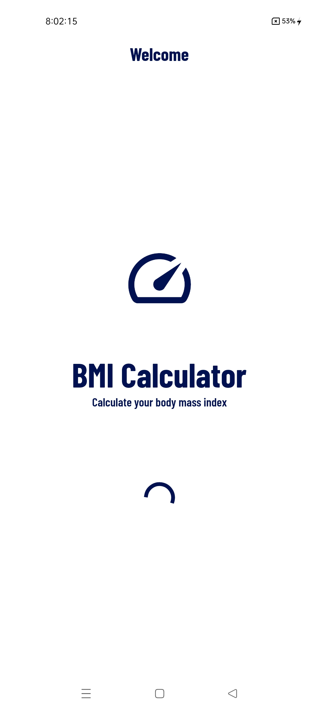
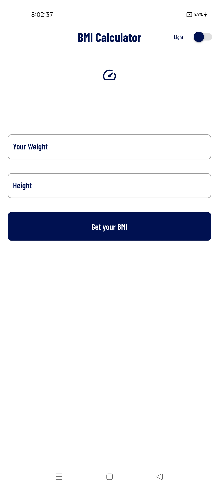
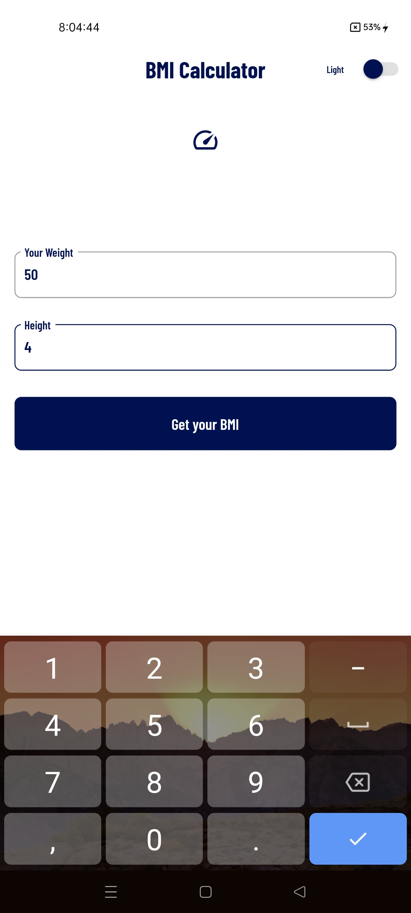
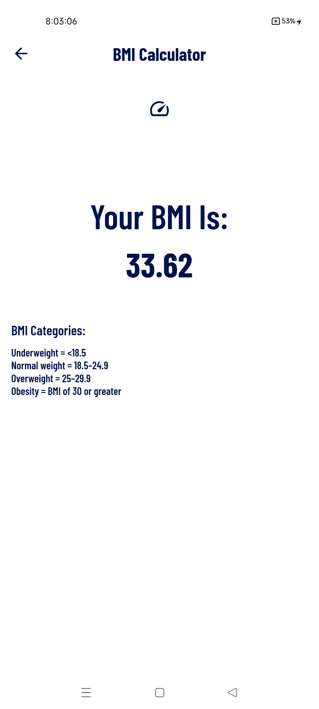
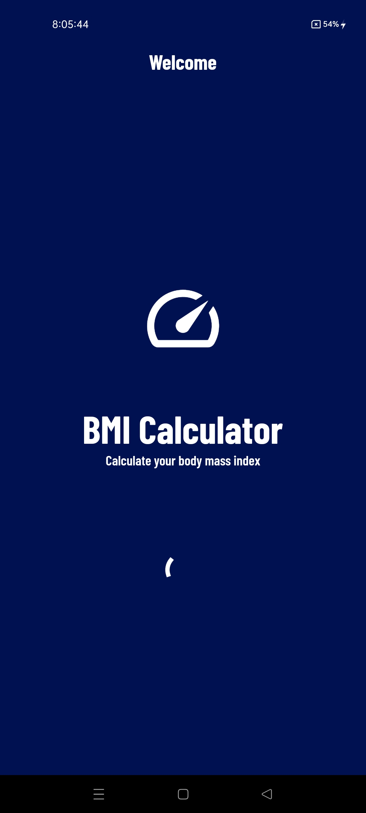
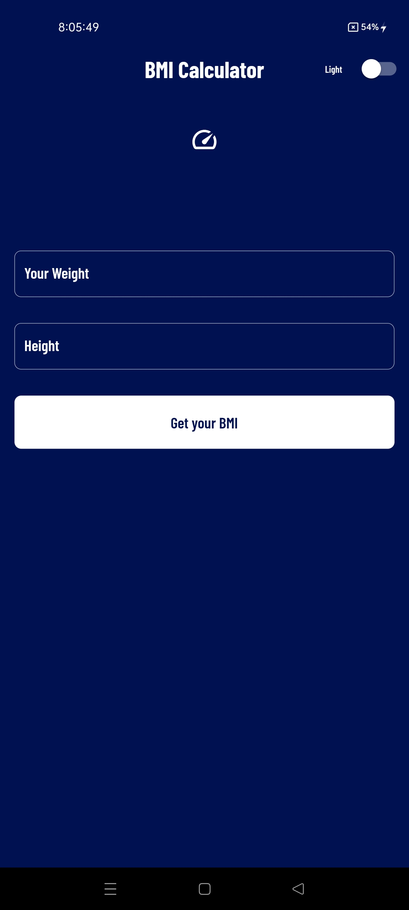
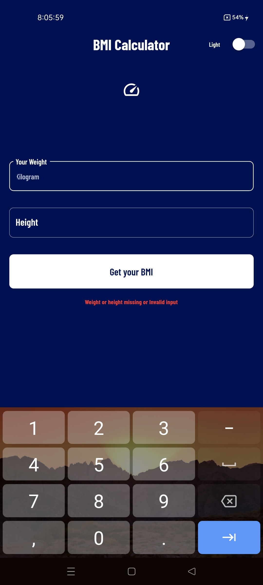
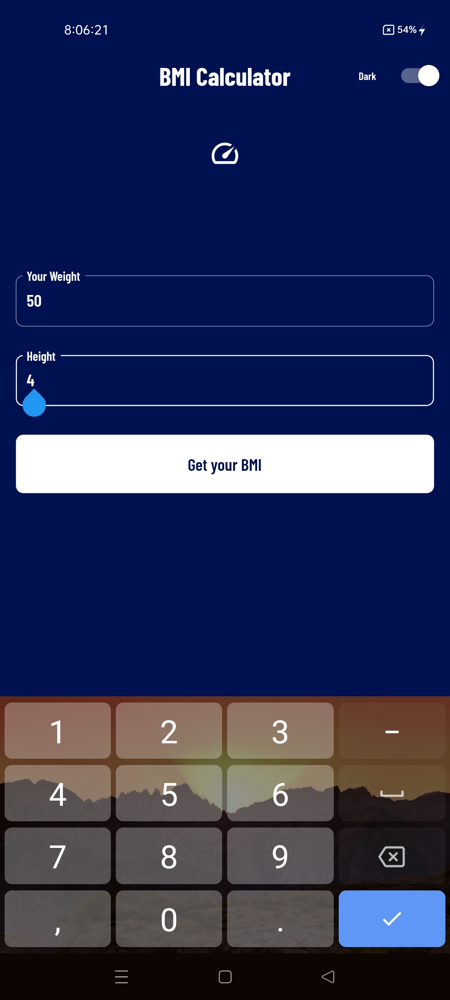
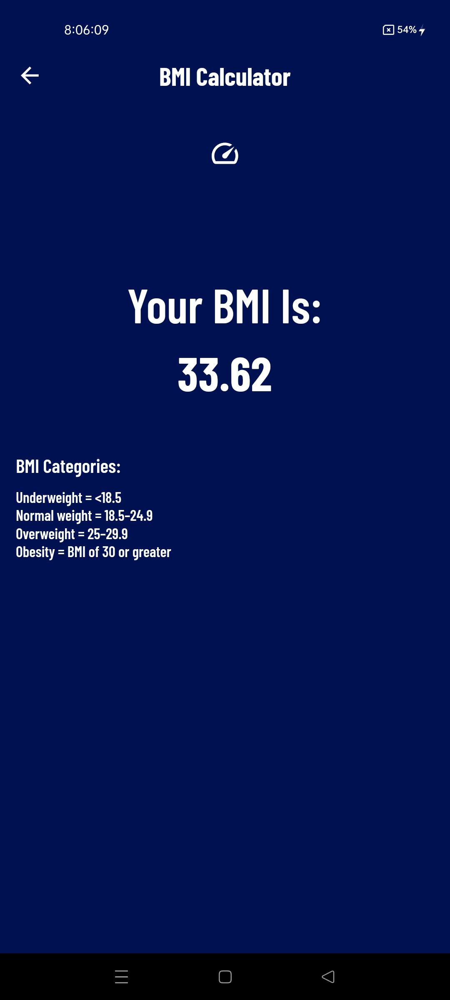

# BMI Calculator

This is a simple mobile application that can calculate Body Mass Index. Main purpose of this project is working on theme.

## Technologies:
1. Flutter.
2. Dart.

## Packages: 
1. provider

# Screenshots
## (Light)

  
  
  
  
  

## (Dark)

  
  
  
  
  

